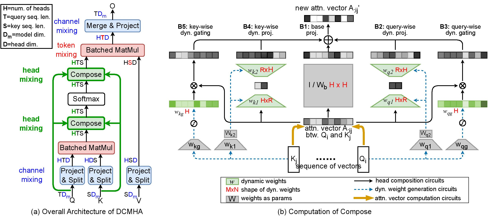

# DCFormer

This repository contains the code in both PyTorch and Jax for our paper.

> [**Improving Transformers with Dynamically Composable Multi-Head Attention**](https://arxiv.org/abs/2405.08553)\
> Da Xiao, Qingye Meng, Shengping Li, Xingyuan Yuan\
> ICML 2024 (<strong>oral</strong>)

## About

We propose <strong>D</strong>ynamically <strong>C</strong>omposable <strong>M</strong>ulti-<strong>H</strong>ead <strong>A</strong>ttention (<strong>DCMHA</strong>), a parameter and computation efficient attention architecture that tackles the shortcomings of Multi-Head Attention(MHA) and increases the expressive power of the model by dynamically composing attention heads. At the core of DCMHA is a `Compose` function that transforms the attention score and weight matrices in an input-dependent way. DCMHA can be used as a drop-in replacement of MHA in any transformer architecture to obtain the corresponding DCFormer.

In practice, we train DCFormer on TPU for efficiency and then infer on GPU for convenience, so we open-source Jax training code and PyTorch inference code in two separate folders. 

## News and Updates

- [2025/2/13] We update the `pytorch/dcformer` folder, these scripts support the pre-training and supervised fine-tuning of the DCFormer model using DeepSpeed's ZeRO-0, ZeRO-1, ZeRO-2, ZeRO-3 and Huggingface's trainer. Please refer to `pytorch/dcformer/README.md` [README](https://github.com/Caiyun-AI/DCFormer/blob/main/pytorch/dcformer/README.md) for more traing details.

## Jax 

- The source code is in the `jax/` folder, supporting train DCFormer on TPU or GPU with [google/MaxText](https://github.com/google/maxtext).
- Please refer to `jax/README.md` for details.

## PyTorch

- The source code is in the `pytorch/` folder, supporting accelerated inference with *torch.compile*.
- We also uploaded pretrained [(DCFormer-2.8B)](https://huggingface.co/Caiyun-AI/DCFormer-2.8B) (<strong>DCFormer++2.8B</strong> in the paper) and [(DCPythia-6.9B)](https://huggingface.co/Caiyun-AI/DCPythia-6.9B) to Huggingface🤗. 
- Please refer to `pytorch/README.md` for details.

## Synthetic tasks 
Synthetic tasks dataset in the paper is located at `data/synthetic_dataset.jsonl`. Each line in the file contains an in-context learning sample, where words in the bracket `[]` are compared to calculate accuracy. Eg.

<pre>
< Elizabeth has jeans. Steven has strawberries. Steven has a fox. >. Steven does not have a kind of clothing
< Karen has a taxi. Karen has a pig. Paul has a cocktail. >. Karen does not have a kind of drink
< Ruth has a sweater. Steven has a taxi. Ruth has a handgun. >. Ruth does not have a kind of [ <b>vehicle<b> ]
. . .
<code>
